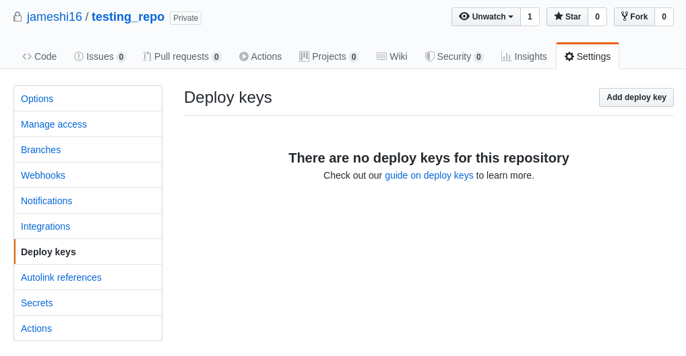
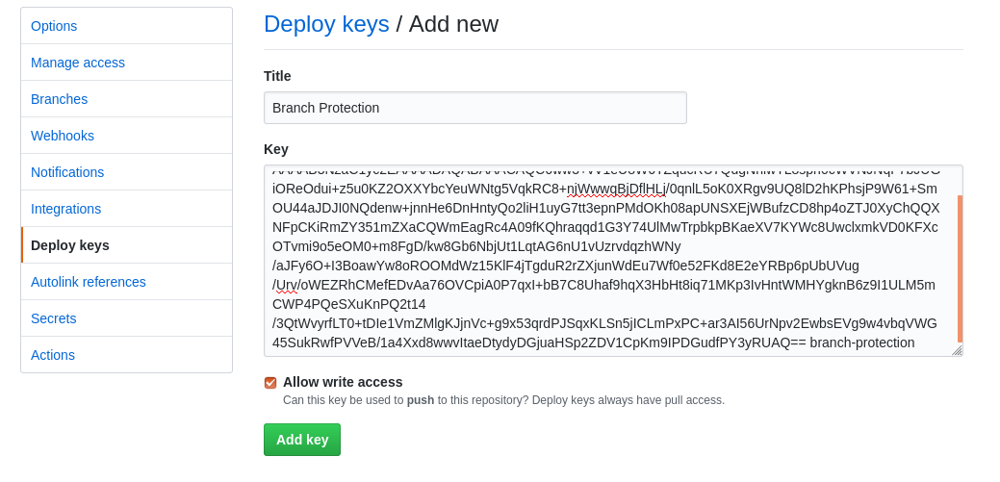
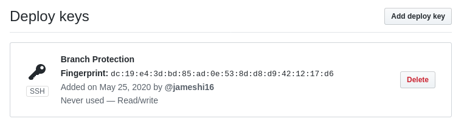
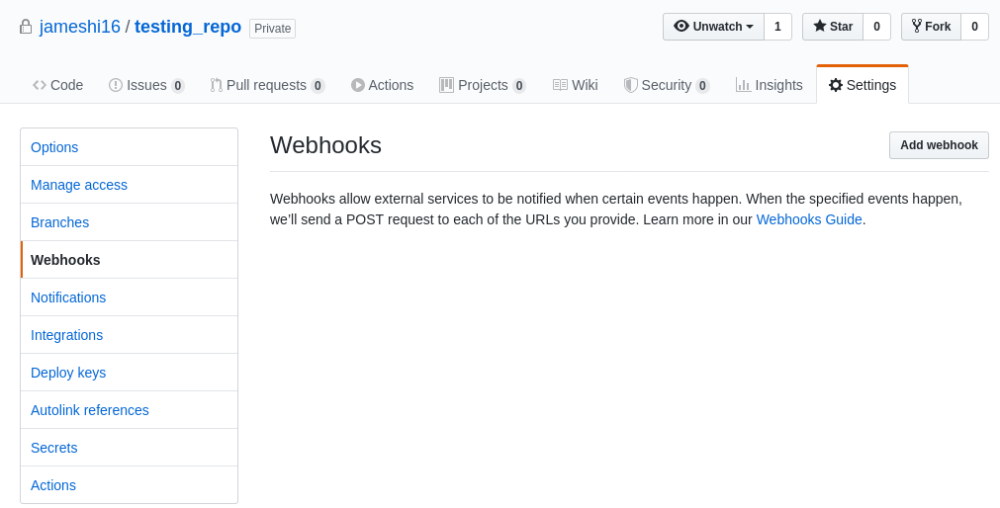
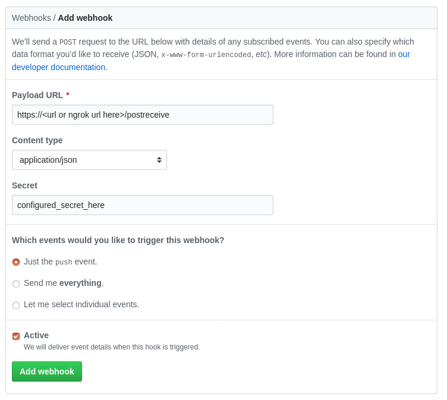

# Branch Protection

Too poor to afford Pro? Still need some sort of branch protection found in the Pro plan? If you've got [`ngrok`](https://ngrok.com/), and a cheap computer like a Raspberry Pi, this project _might_ be for you.

This project is built on Python 3.6.8, with the explicitly defined package versions in `requirements.txt`. Try to use a WSGI server instead of the development server (i.e. `python main.py`) in production. The Payload URL should be suffixed with `/postreceive`.

## Pre-requisites

Please ensure you have `git` installed and linked on your system. In the deployment site, run `pip -r requirements.txt`.

## Quick Start

1. Create a configuration file detailed in the [configuration](#Configuration) section, and save it into `config.json`.
    ```
      $ vim config.json
        <fill in details in config.json>
      $ ls
        Dockerfile  LICENSE  README.md  branch-protection.wsgi  config.json  mail.py  main.py  protected_repo.py  requirements.txt
    ```
2. Generate an SSH key.
    ```
      $ mkdir ssh
      $ ssh-keygen -b 4096 -t rsa -C branch-protection -f ssh/key
        Generating public/private rsa key pair.
        Enter passphrase (empty for no passphrase): 
        Enter same passphrase again: 
        Your identification has been saved in ssh/key.
        Your public key has been saved in ssh/key.pub.
        The key fingerprint is:
        SHA256:qTMwBm1heC+Vo3qWuPHqMSvd2B9KEGA6QHtR/cVFHeE branch-protection
        The key's randomart image is:
        +---[RSA 4096]----+
        |+o o+...  . oo.oo|
        |+.ooo.+.   o  .. |
        |o.ooo+ .. .    E |
        | ..+o .  o       |
        |  .o+o  S        |
        |  +o+o .         |
        | .oX. =          |
        |. +=+. +         |
        | o+....          |
        +----[SHA256]-----+
    ```
3. Create a SSH configuration file under `ssh/config`.
    ```
    $ cat << EOF > ssh/config
    Host github.com
      IdentityFile /var/www/.ssh/key
    EOF
    ```
4. Navigate to your repository's "Deploy keys" settings page.
    
5. Click on "Add deploy key", and copy the contents of `ssh/key.pub` into the `Key` field. Make sure to check "Allow write access".
    
6. Click "Add key", and confirm your password to continue if necessary.
7. The key should have been added successfully:
    
8. Build the `Dockerfile` image.
    ```
    $ docker build . -t branch-protection
    ```
9. Run the docker, binding `config.json` and the `ssh/` folder to `/var/www/branch-protection/config.json` and `/var/.ssh` respectively.
    ```
    $ docker run --mount type=bind,source=$PWD/config.json,target=/var/www/branch-protection/config.json --mount type=bind,source=$PWD/ssh,target=/var/.ssh branch-protection:latest
    ```

10. Find out the IP address of the docker you just launched.
    ```
    $ docker inspect --format='{{range .NetworkSettings.Networks}}{{.IPAddress}}{{end}}' $INSTANCE_ID
    ``` 
11. Configure proxy pass for your web server (take care to pass all headers), or test `branch-protection` with [`ngrok`](https://ngrok.com/). Instructions for `ngrok`:
    - Follow the instructions on `ngrok` [getting started](https://dashboard.ngrok.com/get-started/setup) to create an account and configure `ngrok`.
    - Run:
        ```
        $ ./ngrok http <ip-address-to-docker-here>:80
        ```
12. Navigate to your repository's "Webhooks" settings page.
    
13. Click on "Add webhook", and fill in the details. Ensure `Payload URL` is suffixed with `/postreceive`, and `Content Type` is set to `application/json`. `Secret` is what you configured in `config.json` in step 1.
    
14. Click on "Add webhook", and confirm your password if necessary.
15. The ping event should be successful. Once connectivity has been confirmed, try pushing to master directly using a git command. 
    - Branch protection should revert that commit automatically. 
    - Merge request commits from GitHub should not trigger a revert.

## Caveats

- If the commit is done directly using GitHub's web editor, then branch protection will treat it as a valid commit.
- Branch protection revert commits softly, meaning that no `git push --force` is used. If a malicious user pushes 100 commits while the branch protection webhook is running, then there will be 100 reverts.
- You need a server for this webhook, which _may_ outweigh the cost of just buying [GitHub Pro](https://github.com/pricing).
- This was a weekend (if weekends are 3 days long) project of a random person on the internet.
 
## Configuration

The config file, `config.json` generally looks like this:
```json
{
  "secret": "you share this secret with Github's Webhook page, value is whatever you want",
  "repos": [
    {
      "name": "<org/personal name>/<repo>, like jameshi16/PTRPG",
      "branch": "branch name to protect. typically master or production or release",
      "url": "the HTTPS clone URL, or the SSH clone URL. e.g. git@github.com:jameshi16/PTRPG",
    }
  ],
  "commit_user": {
    "name": "name of the user to commit the reverting changes to. does not have to be a real user",
    "email": "email of the user to commit the reverting changes to. does not have to be a real email"
  },
  "smtp": {
    "enabled": true,
    "host": "smtp server host",
    "port": 587,
    "username": "username@email.com",
    "password": "insert password here",
    "use_tls": true,
    "use_ssl": false
  },
  "notify_emails": ["list@email.com", "of@email.com", "emails@email.com", "to@email.com", "notify@email.com"]
}
```

### SMTP

The SMTP settings `use_tls` and `use_ssl` are used for STARTTLS or SSL SMTP server connections respectively. Consult your email provider's manuals to figure out which one is being used. To disable notifications, set `enabled` to `false`, which ignores the existence of the other SMTP settings.

```json
  ...
  "smtp": {
    "enabled": false
  },
  ...
```

#### Gmail

1. Disable secure app access through this [link](https://myaccount.google.com/lesssecureapps).
2. Use the following SMTP configuration:
    ```json
    "smtp": {
      "enabled": true,
      "host": "smtp.google.com",
      "port": 587,
      "username": "googleaccount@gmail.com",
      "password": "putpasswordhere",
      "use_tls": true
    }
    ```

## Private Repositories

It is highly recommended that you setup cloning of private repositories over Deploy Keys rather than using a user's own SSH key, or personal access token.

### Using a Deploy key

Generate a SSH key and paste the public key portion in the deploy key setting within the repository of your choice. Remember to check the `Write access` checkbox so that the webhook can automatically revert the erroneous commits.

1. On the server where this script will be run, place the private key in to the `~/.ssh` folder.
2. Test if you can clone a repository using the normal `git clone` command.
3. If Step 2 is successful, the "URL" field in the configuration should be: `git@github.com:<username/org name>/<repo>.git`

### Using a personal access token

Generate a personal access token through your personal account, or through a [machine user](https://developer.github.com/v3/guides/managing-deploy-keys/#deploy-keys).

1. This [shortcut](https://github.com/settings/tokens) should bring you to the personal access tokens page
2. The "URL" field in the configuration should be: `https://<username>:<access token>@github.com/<username/org name>/<repo>.git` 

## Dockerfile

The Dockerfile in the repository builds the `branch-protection` docker image, which runs `mod_wsgi` with `Apache2`. All of the required files to run the server, except for `config.json` and any SSH keys will be copied into the resultant image.

Build the docker image:
```
$ docker build . -t branch-protection
```

After creating `config.json`, run the container with the following command:
```
$ docker run --mount type=bind,source=$PWD/config.json,target=/var/www/branch-protection/config.json branch-protection:latest
```

**Quirk**: For some reason (don't want to investigate further), `git clone` doesn't work immediately due to some issue involving SSH, nginx, WCGI and/or Python. Hence the Docker's starting script runs a fire-and-ignore SSH command to get the gears going, which fixes the `git clone` issue. Therefore, it is okay if you see this command fail at the start of your logs (like `git@github.com: Permission denied (publickey)`).
```
$ su www-data -s /bin/bash -c "ssh -o StrictHostKeyChecking=no git@github.com"
```

### SSH Keys

If you chose to use deploy keys, you need to create the required SSH resources. Typically, you'd create a folder, generate SSH keys with `ssh-keygen`, and create a SSH `config` file. These keys will be copied to `/var/www/.ssh` from your mountpoint at `/var/.ssh` (this is done so I can `chown -R www-data:www-data` without ruining your host files), so any absolute paths will need to contain `/var/www/.ssh`.

```
$ mkdir ssh
$ ssh-keygen -N '' -b 4096 -t rsa -C branch-protection -f ssh/key
$ touch ssh/config
$ cat << EOF > ssh/config
Host github.com
  IdentityFile /var/www/.ssh/key
EOF
```

Then, you'd copy the `.pub` version into the `Deploy keys` section of your Github repository, and then run the container with the following command:
```
$ docker run --mount type=bind,source=$PWD/config.json,target=/var/www/branch-protection/config.json --mount type=bind,source=$PWD/ssh,target=/var/.ssh branch-protection:latest
```
